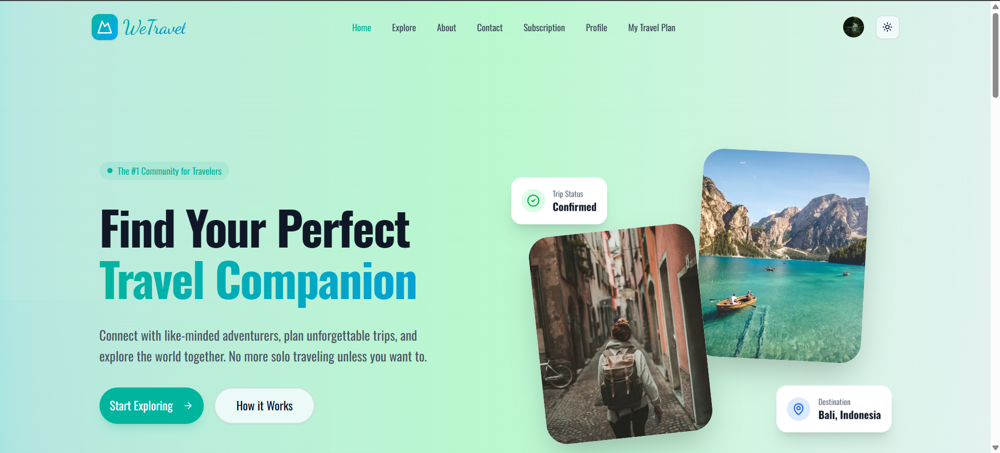
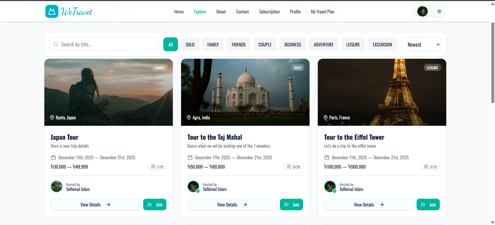
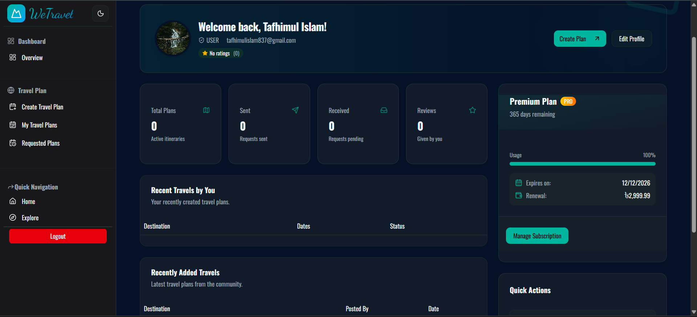
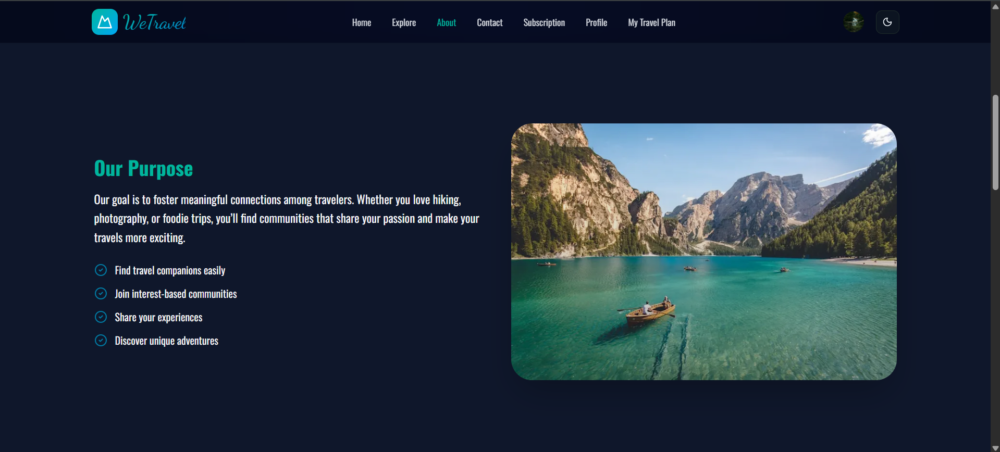

# 🌍 We-Travel Frontend

<div align="center">

[](https://nextjs.org/)
[](https://react.dev/)
[](https://www.typescriptlang.org/)
[](https://tailwindcss.com/)

**Modern Travel Planning Social Platform - Client Application**

[🚀 Live Demo](https://we-travel-theta.vercel.app)

</div>

## Project Overview

**We-Travel** is a travel planning social platform that enables users to explore, create, and join travel plans with other travelers.

---

## 📸 Screenshots

### Hero & Landing Page
<div align="center">
  
  <p><em>Beautiful landing page with hero section and featured travel plans</em></p>
</div>

### Explore & Browse
<div align="center">
  
  <p><em>Discover travel plans from the community with filtering and search</em></p>
</div>

### User Dashboard
<div align="center">
  
  <p><em>Personal dashboard with travel statistics, activity, and subscriptions</em></p>
</div>

### About Page
<div align="center">
  
  <p><em>Learn more about We-Travel platform and our mission</em></p>
</div>

---

## 🎯 Key Features

| Feature | Description |
|---------|-------------|
| **Public Travel Exploration** | Browse all travel plans from the community |
| **User Authentication** | Secure login/registration with JWT tokens |
| **Travel Plan Creation** | Create detailed plans with itineraries and budgets |
| **Request Management** | Send/receive/approve travel plan join requests |
| **User Dashboard** | Personal statistics, travel activity, & subscriptions |
| **Admin Dashboard** | System analytics, user management |
| **Subscription Management** | Monthly/yearly premium access |
| **Dark Mode Support** | Seamless dark/light theme switching |

## 🛠 Tech Stack

### Framework & Runtime
- **Next.js 16.0.7** - React framework with SSR & SSG
- **React 19.2.0** - UI library & components
- **TypeScript 5.8+** - Type-safe development

### Styling & UI
- **Tailwind CSS 4.0+** - Utility-first CSS framework
- **shadcn/ui** - High-quality React components
- **Lucide React 0.556.0** - Icon library
- **Framer Motion 12.23.25** - Animations

### Form & Validation
- **React Hook Form 7.68.0** - Performant form handling
- **Zod 3.25.76** - TypeScript-first validation

### Other Libraries
- **Recharts 3.5.1** - Chart library
- **next-themes 0.4.6** - Dark mode
- **Sonner 2.0.7** - Toast notifications
- **date-fns 4.1.0** - Date utilities

## Quick Start

### Prerequisites
- Node.js v18+
- npm v9+
- Backend API running

### Installation

```bash
# Clone repository
git clone https://github.com/Tafhim301/We-Travel-Client.git
cd We-Travel-Client

# Install dependencies
npm install

# Create .env.local
echo "NEXT_PUBLIC_BACKEND_URL=http://localhost:5000" > .env.local
echo "NEXT_PUBLIC_APP_URL=http://localhost:3000" >> .env.local

# Start development server
npm run dev
```

Open [http://localhost:3000](http://localhost:3000)

## Build & Deployment

```bash
# Production build
npm run build
npm run start

# Linting
npm run lint

# Deploy to Vercel
# Connect GitHub repo to Vercel and deploy
```

**Live URL:** https://we-travel-theta.vercel.app

## 📁 Project Structure

```
src/
├── app/                    # Next.js pages & layouts
├── components/            # React components
├── lib/                   # Utilities & context
├── hooks/                 # Custom hooks
└── services/              # API functions
```

## Pages & Routes

| Route | Auth | Purpose |
|-------|------|---------|
| `/` | ❌ | Home |
| `/explore` | ❌ | Browse plans |
| `/travel-plan/[id]` | ❌ | Plan details |
| `/auth/login` | ❌ | Login |
| `/auth/register` | ❌ | Register |
| `/dashboard/overview` | ✅ | User dashboard |
| `/dashboard/admin/overview` | ✅ ADMIN | Admin dashboard |

## API Integration

Key endpoints:
- `/api/auth/login` - User login
- `/api/user/register` - Registration
- `/api/travelPlans` - List/create plans
- `/api/travel-requests/:planId` - Join request
- `/api/stats/me/dashboard` - User stats
- `/api/stats/admin/overview` - Admin stats

See [BACKEND_README.md](./BACKEND_README.md) for full API docs.

## 📹 Video Summary & Demo

**[Add your video walkthrough here - Click to watch feature demo]**

Key Features:
- ✅ User registration & authentication
- ✅ Browse & filter travel plans
- ✅ Create travel plans with itineraries
- ✅ Request to join plans
- ✅ Admin dashboard with analytics
- ✅ Subscription management
- ✅ Dark/light mode

## Project Statistics

| Metric | Value |
|--------|-------|
| Total Pages | 18+ |
| Total Components | 40+ |
| TypeScript Files | 81 |
| Skeleton Loaders | 6 |
| Lines of Code | 5,000+ |

## Resources

- [Next.js Docs](https://nextjs.org/docs)
- [React Docs](https://react.dev)
- [Tailwind CSS](https://tailwindcss.com)
- [shadcn/ui](https://ui.shadcn.com)
- [Backend Docs](./BACKEND_README.md)

## Support

- **Live Demo:** https://we-travel-theta.vercel.app
- **GitHub:** https://github.com/Tafhim301/We-Travel-Client
- **Issues:** [Report a bug](https://github.com/Tafhim301/We-Travel-Client/issues)

---

<div align="center">

Made by Tafhimul Islam

[⬆ Back to top](#-we-travel-frontend)

</div>
